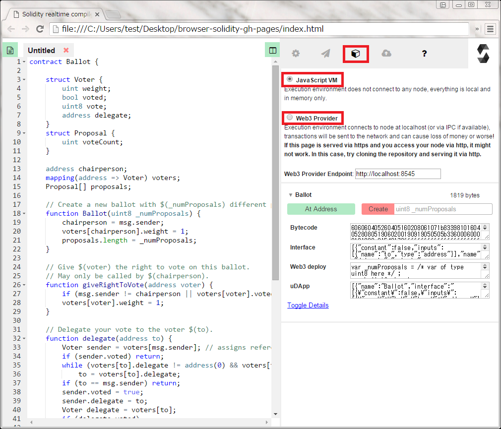

# より便利なContract開発環境の活用

前節までで、gethを用いてコマンドライン上でSolidity言語によるContractの作成からコンパイル、そして実行までを行う手順を見てきました。

しかしこれらは見てきたように煩雑な操作が必要で、Solidity言語を用いてContractを実際に試行錯誤でコーディングしていくには不適です。

そのため、Contractのコーディングとコンパイル及び実行を助ける幾つかの開発環境が開発され始めています。この節では、これらの中の一つの「[browser-solidity](https://github.com/chriseth/browser-solidity)」の使い方を解説します。

[browser-solidity](https://github.com/chriseth/browser-solidity)はSolidity言語の開発者の一人である[chriseth](https://github.com/chriseth)により開発されているSolidity言語用Contract開発環境（IDE）であり、Webブラウザ上で
* Contractのコーディング
* コンパイル
* 実行
    * ブロックチェーン上への登録
    * Contract上の関数の実行

が可能です。

## browser-solidityのダウンロードと起動
browser-solidity[はGithubから最新バージョンのzipファイル](https://github.com/chriseth/browser-solidity/archive/gh-pages.zip)をダウンロードし、それを解凍したフォルダ内のindex.htmlをブラウザで開くことで利用可能です[^1]。

実際にindex.htmlをブラウザで開いた画面を下図に示します。画面は大きく左右２つに分かれています。左側はSolidity言語のコードエディタになっており、右側はそのContractの各種情報の表示や実行実行等を行う画面になっています。

browser-solidityは作成されたContractを２通りの方法方で実行することが可能です。これらの方法は、画面右の箱型のタブを押下して現れるラジオボタン「Java Script VM」と「Web3 Provider」で切り替えることが出来ます（下図）。

* **ブラウザ上での疑似実行**： 実際のEthereumノードには接続せず、ブラウザ上のJavascript VM 上でContractの関数を疑似的に実行。
* **Blockchain上での実行**：実際のEthereumノードに接続し作成したContractをブロックチェーン上に登録した上でContractの関数を実行。

次の節から後者の「Blockchain上での実行」についてどのように行うのかを見ていきます。

## Browser SolidityとEthereumノードを接続する。
browser solidityから実際のBlockchainに作成したContractを登録したりBlockchain上のContractを実行したりするために、まずはbrowser solidityとEthereumノードを接続する必要があります。

### gethの起動
これまでのようにgethを起動しテストネットに接続します。下記のコマンドを実行します。

まずはブラウザ上のJavascript VM 上でContractの関数を疑似的に実行する方法を見てみましょう。

先述のとおり箱型のタブを押下して現れる「Java Script VM」のラジオボタンを選択した状態にしておきます。

ここでは例として「Contractを作成する」節<!--[REF]-->で使用した「SingleNumRegister」Contractコードを左側のコード・エディタ部分に入力します。その後右下の「Create」ボタンを押下すると、Contractがコンパイルされメモリ上の疑似的なブロックチェーン上に登録されます[^2]。

<!--
## そのほかの機能
コントラクタの引数
AtAddress botann 

-->

#### 脚注
[^1] gitに慣れている方はもちろんgithubリポジトリをcloneしてもいいですし、[browser-solidityのサイト](https://chriseth.github.io/browser-solidity/)も公開されているのでそこにアクセスして利用することも可能です。

[^2]ここでは今回のContractが"0x692a70d2e424a56d2c6c27aa97d1a86395877b3a"というメモリ上の疑似アドレスに登録されたことが画面の表示から見て取れます。